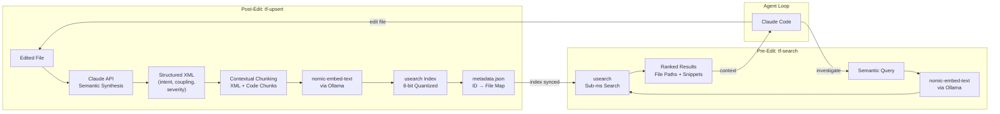

# TurboFind Master Plan

## 1. Enabling Large Codebase Migrations/Refactoring without Omissions, Duplicates, and Errors

Codebase migrations typically rely on lexical search tools (`grep`, `ripgrep`) to identify relevant files. These tools match syntax and keywords so have only superficial semantic coupling. 

For example, an authorization migration searching for the keyword "auth" will miss a file that implements a bypass using `if user.role == 99: return True`. This hidden coupling where components are conceptually linked but share no keywords is a primary source of incomplete migrations and subsequent errors.

AI coding agents currently have this limitation. When they look across a large repository (e.g., >3,000 files), they cannot (and may not want to) put the entire codebase into context, so they start with lexical search tools. So the agent's context window is populated with incomplete information, leading to incomplete refactoring strategies with significant blind spots (because they're looking at a very large landscape through a narrow keyhole).

---

## 2. Reliable Recall for Large Codebase Refactoring via Semantic Analysis + Vector Retrieval

TurboFind addresses this limitation by combining the frontier models' deep semantic analysis with local vector retrieval. This approach captures the architectural intent of the code, making it searchable even without keyword overlap.

```text
┌─────────────────────────────────────────────────────────────────┐
│                    TURBOFIND ARCHITECTURE                       │
│                                                                 │
│   Semantic Analysis           +    Local Vector Search          │
│   (Extracts core intent            (Retrieves by concept,       │
│    and hidden coupling)             not by keyword)             │
│                                                                 │
│   Addresses the context limit     Addresses the shallowness     │
│   of LLMs by ensuring only        of raw code embeddings by     │
│   highly relevant semantic        indexing structural meaning.  │
│   data is retrieved.                                            │
│                                                                 │
│   RESULT: The vector index encodes architectural meaning,       │
│   enabling accurate retrieval at scale.                         │
└─────────────────────────────────────────────────────────────────┘
```

**How it works:**
1. **Semantic Tagging:** An LLM reads each file and generates a structured summary (intent, coupling, migration risks).
2. **Contextual Embedding:** This summary is prepended to chunks of the source code before embedding. The resulting vector encodes the architectural purpose of the code rather than just its syntax.
3. **Intent-Based Retrieval:** The agent queries the local vector database using semantic concepts (e.g., "session validation bypass logic") and retrieves relevant files in ~100–300ms (dominated by local embedding; the vector lookup itself is sub-millisecond), regardless of keyword overlap.

---

## 3. Architecture: Contextual Local Embeddings



### Tech Stack

| Component | Technology | Rationale |
|:---|:---|:---|
| **Vector Engine** | `usearch` (in-memory, 8-bit scalar quantization) | Sub-millisecond local search, tiny memory footprint, no server process |
| **Embedding Model** | `nomic-embed-text` via Ollama (768-dim, local) | Zero-cost, zero-infrastructure, no API keys, code never leaves the machine |
| **Semantic Synthesis** | Anthropic Claude API (`claude-haiku-4-5-20251001` for bulk, Sonnet 4.6 for deep analysis) | Structured code understanding that raw embeddings can't capture |
| **State Management** | `metadata.json` sidecar file with `fcntl`/`msvcrt` file locking | Maps 64-bit vector IDs to human-readable file paths and chunk ranges; atomic writes via temp file + `os.replace()`; exclusive lock prevents concurrent subagent corruption |
| **Config** | `.turbofind.toml` + `.gitignore` via `pathspec` | Per-file and per-batch guardrails; exclusion patterns inherit from `.gitignore` automatically |
| **Agent Integration** | CLI executables + `CLAUDE.md` directives | Stateless, no background daemons, works with standard Claude Code workflows |

### Design Rationale: Why Not Embed Raw Code?

Embedding raw source code typically results in vectors that cluster based on lexical similarity (e.g., variable names and syntax). However, for migration tasks, the crucial dimension is functional intent. 

For instance, `check_permission(role_id)` and `validate_gate(level)` serve the same architectural purpose but share no keywords. Embedding the raw code will place them far apart in the vector space. By performing a semantic analysis step first and prepending the resulting metadata (e.g., "authorization bypass logic") to the code chunk, both files are clustered correctly based on their function, significantly improving retrieval accuracy.

---

### The Two CLI Tools

#### A. `tf-search` — The Pre-Edit Hook

Replaces speculative regex scanning with high-fidelity semantic retrieval.

**Execution Flow:**

1. Accepts a semantic intent string: `tf-search "find session validation and legacy gatekeepers"`
2. Embeds the query locally via Ollama (`nomic-embed-text`, prefixed with `search_query: `), ~50–200ms on Apple Silicon
3. Performs sub-millisecond in-memory search against the `usearch` index
4. Returns the top-K results (file paths, chunk ranges, relevance scores) to stdout

#### B. `tf-upsert` — The Post-Edit Hook

Keeps the semantic index perfectly synchronized with the filesystem. Uses a **"Nuke and Pave"** file-level replacement strategy.

> **Why file-level, not chunk-level diffing?** Because the semantic context of *surrounding* code changes when you edit one function. A diff-based update would leave stale context tags on neighboring chunks. Nuking the entire file's vectors and re-synthesizing guarantees consistency.

**Execution Flow:**

1. Accepts a file path: `tf-upsert src/auth_service.py`
2. **Nuke:** Looks up old vector IDs for this file in `metadata.json`, removes them from `usearch`
3. **Synthesize:** Sends the full file to Claude API with:
   - **Prompt Caching:** `repo_map.txt` (global architecture context) is placed in the system prompt with `cache_control` — written once, read at 90% discount on all subsequent files
   - **Structured Analysis Prompt:** Claude adopts a migration-auditor persona, opens an `<internal_scratchpad>` to trace data flow and variable origins, then outputs:
     - `<core_intent>` — what the code does in plain language
     - `<hidden_coupling>` — non-obvious dependencies on other services
     - `<legacy_coupling_severity>` — 1-10 score flagging migration risk
4. **Contextual Chunking:** Splits code into ~100-line chunks. The **same file-level XML synthesis is prepended identically to every chunk** from that file. This is intentional: file-level tagging ensures that every chunk from a file surfaces when the file's architectural role is queried, even if only one function contains the relevant logic. Per-chunk synthesis would be more expensive and would lose the cross-function context that makes file-level analysis valuable for migration tasks.
5. **Embed:** Each contextualized chunk is embedded locally via Ollama (`nomic-embed-text`, prefixed with `search_document: `)
6. **Pave:** Adds new 8-bit vectors to `usearch`, updates `metadata.json`, persists both to disk

---

## Agent Integration via CLAUDE.md

The tools bind to Claude Code through a `CLAUDE.md` project configuration file — no MCP server, no background daemons, no file watchers.

```markdown
# TurboFind Migration Protocol

You have access to two semantic search tools. Use them directly in the terminal:

- `tf-search "<query>"` — Semantic vector search across the indexed codebase
- `tf-upsert <filepath>` — Updates the semantic index after an edit

## PRE-EDIT RULE (Investigation)
When investigating the codebase, planning a migration, or locating dependencies:
Execute `tf-search "<semantic intent>"` FIRST, then proceed with your normal workflow.

## POST-EDIT RULE (Synchronization)
After modifying, refactoring, or creating any file:
IMMEDIATELY execute `tf-upsert <filepath>` before your next step.
```

---

## 4. Cost Model: Free Local Vectors, Negligible API Cost

With local embeddings via Ollama, the **only variable cost is Claude API calls** for semantic synthesis during `tf-upsert`.

### Per-File Token Budget

| Component | Input Tokens | Output Tokens |
|:---|:---|:---|
| System prompt (instructions, persona) | ~800 | — |
| repo_map.txt (cached after first call) | ~2,000 | — |
| File source code (avg ~220 lines) | ~1,760 | — |
| Scratchpad + XML synthesis | — | ~600 |
| **Total per file** | **~4,560 input** | **~600 output** |

### Estimated Cost at Scale (OpenClaw-sized repo: ~2,500 indexable files)

| Strategy | Haiku 4.5 ($1/$5 per M) | Sonnet 4.6 ($3/$15 per M) |
|:---|:---|:---|
| Naive (no optimization) | $15.20 | $45.60 |
| + Prompt Caching | $10.64 | $31.92 |
| **+ Caching + Batch API** | **$5.32** | **$15.96** |

**Per-file cost during active migration (real-time, cached): $0.004 – $0.018**

> Use Haiku for bulk initial indexing. Use Sonnet for high-severity files flagged during the first pass. Batch API gives 50% discount for async bulk operations.

---

## 5. Implementation Phases: MVP to Integration

---

### Phase 1: Environment & Trap Codebase

**Objective:** Establish the local environment and build a Python "Trap" codebase designed to expose the limitations of lexical search during a migration.

**Tasks:**

- [ ] **Dependencies:** Create `requirements.txt` with pinned versions (≥14 days old for InfoSec):
  - `usearch==2.23.0` — Vector engine
  - `anthropic==0.86.0` — Claude API for semantic synthesis
  - `ollama==0.6.1` — Local embedding inference
  - `numpy==2.4.3` — Vector math
  - `pathspec==1.0.4` — `.gitignore` parsing for file exclusion
  - `tomli==2.4.0` — `.turbofind.toml` config loading
  - `setuptools==82.0.1` — Package discovery for `src/` layout
- [ ] **Ollama Setup:** Document `ollama pull nomic-embed-text` in setup steps
- [ ] **The Trap Codebase:** Create a `demo_repo/` directory with **~50 Python files** across 4 service boundaries simulating a legacy SaaS backend:
  - `services/auth/` — Standard authentication logic (easy for grep: uses "auth", "login", "password")
  - `services/billing/` — Billing and subscription management
  - `services/gateway/` — API gateway routing and middleware
  - `services/analytics/` — Usage tracking and reporting
  - **Hidden coupling traps (5-10 files):**
    - A gateway middleware that checks `if user.clearance_level >= 99: return next_handler()` — authorization bypass that never mentions "auth"
    - A billing module that reads session tokens directly from a shared Redis key — session coupling with no import relationship
    - An analytics aggregator that hardcodes a fallback user object when SSO tokens expire — shadow identity logic
    - A rate limiter that exempts requests with a specific internal header — privilege escalation with no "role" or "permission" keywords
    - Utility functions that pickle/unpickle user state in a format only the legacy identity provider understands — serialization coupling
- [ ] **Global Context:** Create `repo_map.txt` — a concise, high-level summary (< 2,000 tokens) of the 4 services and their intended architectural boundaries. *Note: This must remain a conceptual abstract, not an exhaustive file tree, to prevent attention dilution during semantic synthesis.*
- [ ] **Baseline Documentation:** Document which files `grep -r "auth\|identity\|login\|session\|permission\|role"` finds and which it misses

**Success Criteria:**

- [ ] `demo_repo/` populated with ~50 files across 4 service directories (5 trap files + ~40 realistic noise files: models, handlers, utils, tests, shared config)
- [ ] At least 5 files contain hidden coupling traps that `grep` provably cannot find
- [ ] All trap files use realistic developer comments — no `# TRAP:` annotations that would tip off an AI agent
- [ ] `repo_map.txt` accurately describes the service architecture
- [ ] `scripts/ab_test.sh` runs an A/B comparison (with vs. without TurboFind) and scores recall against ground truth

---

### Phase 2: `tf-search` — The Semantic Search CLI

**Objective:** Build a stateless CLI tool for local vector search using Ollama embeddings (~100–300ms end-to-end, sub-millisecond vector lookup).

**Tasks:**

- [ ] **Initialization:** Load `turbofind.usearch` index and `metadata.json` (handle missing files gracefully with a clear "run tf-upsert first" message)
- [ ] **Ollama Connectivity Check:** On startup, verify Ollama is reachable at `OLLAMA_HOST` (default `localhost:11434`). If not, exit with a clear message: "Ollama is not reachable — run `ollama serve` first."
- [ ] **Query Embedding:**
  - Use Ollama Python client to call `nomic-embed-text`
  - Prefix query with `search_query: ` per Nomic's best practices
- [ ] **Local Search:**
  - Execute `index.search()` in RAM
  - Fetch file paths, chunk ranges, and `core_intent` summaries from `metadata.json`
  - Deduplicate results by file (multiple chunks from the same file → single result with best score)
- [ ] **CLI Output:** Print top-K results to stdout in a format Claude Code can parse. The description text is the `<core_intent>` summary stored in `metadata.json` during `tf-upsert`:
  ```
  [1] src/gateway/middleware.py (score: 0.847)
      Lines 45-92: Request routing with clearance-level gate
  [2] src/auth/login.py (score: 0.823)
      Lines 1-67: Standard login flow with password validation
  ```
- [ ] **Dynamic Thresholding (The "Elbow" Method):** Implement a hybrid strategy to determine which files are returned to Claude:
  - Enforce a maximum limit via `--top-k` (default 10) to cap context window usage.
  - Implement a relative drop-off calculation: analyze the scores of the Top-K results and truncate the list if a dramatic drop in similarity occurs (e.g., cutting off scores of 0.60 that follow a cluster of 0.85s).
  - Establish an empirically determined absolute floor (e.g., `--floor 0.55`) below which all results are discarded to prevent hallucinated matches.

**Success Criteria:**

- [ ] `tf-search "test"` exits cleanly with a helpful message when no index exists
- [ ] Search executes in <10ms (excluding Ollama embedding call)
- [ ] Results include file path, line range, score, and a brief context snippet

---

### Phase 3: `tf-upsert` — The Semantic Sync CLI

**Objective:** Implement the "Nuke and Pave" update logic with Claude-powered semantic synthesis and local embedding.

**Tasks:**

- [ ] **Step 0: Ollama Connectivity Check** — Verify Ollama is reachable (same check as `tf-search`)
- [ ] **Step 1: Nuke** — Remove all existing vectors for the target file from `usearch` and `metadata.json`
- [ ] **Step 2: Synthesize** — Call Claude API with:
  - System prompt with `repo_map.txt` under `cache_control` (prompt caching)
  - Migration-auditor persona prompt
  - Full file source code
  - Require structured XML output: `<semantic_analysis>` containing `<internal_scratchpad>`, `<core_intent>`, `<hidden_coupling>`, `<legacy_coupling_severity>`
- [ ] **Step 3: Contextual Chunking** — Split code into ~100-line segments, prepend XML synthesis to **every** chunk
- [ ] **Step 4: Embed** — Use Ollama to embed each contextualized chunk with `nomic-embed-text` (prefixed with `search_document: `)
- [ ] **Step 5: Pave** — Add new 8-bit vectors to `usearch`, update `metadata.json` (including `core_intent` summary per chunk for use by `tf-search` display), save both to disk
- [ ] **Step 6: CLI Output** — Print progress indicators:
  - 🗑️ Removed N old vectors
  - 🤖 Synthesis complete (severity: X/10)
  - 📐 Embedded N chunks
  - ✅ Index updated
- [ ] **Concurrency Safety:**
  - Acquire an exclusive file lock (`.turbofind.lock`) around the entire load→modify→save cycle
  - Use `fcntl.flock()` on macOS/Linux, `msvcrt.locking()` on Windows
  - Write metadata atomically via temp file + `os.replace()` to prevent corruption on crash
- [ ] **Batch Guardrails:**
  - `tf-upsert .` recursively walks directories, filtering by source extension (`.py`, `.ts`, `.js`, `.java`, `.go`, `.rs`, etc.) and `.gitignore`
  - Per-file limits: `--max-file-size` (default 50KB), `--max-lines` (default 2,000) — skip with warning
  - Per-batch limits: `--max-files` (default 100), `--cost-limit` (default $5.00) — pause for confirmation
  - `--dry-run` mode: preview files, sizes, and estimated costs without calling any APIs
  - Defaults overridable via `.turbofind.toml` config file; CLI flags override config

**Success Criteria:**

- [ ] Tool correctly removes old vectors before adding new ones (no index bloat)
- [ ] Running `tf-upsert` twice on the same unmodified file produces identical vector counts
- [ ] Severity score is visible in terminal output to flag high-risk files

---

### Phase 4: Integration & Benchmark Testing

**Objective:** Integrate the tools with Claude Code and perform a baseline comparison to quantify the retrieval improvements over standard lexical search.

**Tasks:**

- [ ] **CLAUDE.md:** Create the project-level `CLAUDE.md` with the migration protocol directives
- [ ] **Initial Indexing:** Index the entire demo repo:
  ```bash
  tf-upsert .
  ```
- [ ] **The Test — Without TurboFind (Baseline):**
  1. In a fresh Claude Code session *without* TurboFind installed, ask:
     > "Find all the legacy identity and authorization logic in this codebase so I can migrate it to our new Okta-based SSO system."
  2. Document which files Claude finds (it will use `grep`/`rg`) and which it misses
  3. Document whether the resulting refactoring plan is complete or has blind spots
- [ ] **The Test — With TurboFind:**
  1. In a fresh Claude Code session *with* TurboFind's `CLAUDE.md`, give the same prompt
  2. Verify Claude executes `tf-search` automatically
  3. Verify `tf-search` returns the hidden trap files (`gateway/middleware.py`, etc.) alongside the obvious auth files
  4. Verify Claude produces a refactoring plan that includes the hidden-coupling files
  5. Verify Claude calls `tf-upsert` after each edit

**Success Criteria:**

- [ ] **Without TurboFind:** Claude misses ≥3 of the hidden coupling files and produces an incomplete migration plan
- [ ] **With TurboFind:** Claude finds all hidden coupling files and produces a complete migration plan
- [ ] Claude Code calls `tf-upsert` after each edit without being reminded
- [ ] The contrast demonstrates that TurboFind prevented a migration that would have left dangerous legacy bypass logic in place

**Stretch Goal — Quantitative Benchmark:**

> For a future iteration, once we identify a representative open-source codebase with known coupling patterns, measure:
> - **Recall@K:** What fraction of ground-truth relevant files appear in the top-K results?
> - **Precision@K:** What fraction of top-K results are actually relevant?
> - **Migration completeness:** Did the agent's refactoring plan cover all coupled files?
> - **Token efficiency:** How many tokens did the agent consume with vs. without TurboFind?
>
> This requires a labeled ground-truth dataset of semantic dependencies, which is itself a research contribution.

---

### Phase 5: Packaging & Distribution

**Objective:** Package TurboFind so any developer can install it, index their repo, and start a migration in under 5 minutes.

**Tasks:**

- [ ] **`tf-init` helper:** A CLI command that idempotently appends the TurboFind migration protocol to the user's existing `CLAUDE.md` (or creates it). Uses paired HTML comment sentinels (`<!-- turbofind -->` / `<!-- /turbofind -->`) for clean insertion and removal. Supports `--remove` flag to cleanly strip the TurboFind block.
- [ ] **Project root discovery:** `find_project_root()` walks up directories checking for markers in priority order: `repo_map.txt` → `.turbofind.toml` → `.git`. The most specific marker wins, so `repo_map.txt` in a subdirectory takes precedence over `.git/` in a parent.
- [ ] **Environment cleanup:**
  - No hardcoded project IDs or API paths
  - Anthropic API key read from `ANTHROPIC_API_KEY` environment variable
  - Ollama endpoint defaults to `localhost:11434` with an override via `OLLAMA_HOST`
  - Claude model defaults to `claude-haiku-4-5-20251001` with an override via `TURBOFIND_MODEL`
- [ ] **`README.md`:** Clear onboarding for open-source developers:
  - Prerequisites: Python 3.9+, Ollama, Anthropic API key
  - Install: `pip install -e .` (installs all three CLI tools: `tf-init`, `tf-upsert`, `tf-search`)
  - Init: `tf-init` (appends migration protocol to CLAUDE.md)
  - Index: `tf-upsert .` (recursively indexes all source files with guardrails)
  - Go: Launch `claude` and start your migration
- [ ] **`.gitignore`:** Ensure TurboFind runtime artifacts are gitignored: `.turbofind.usearch`, `.turbofind.meta.json`, `.turbofind.meta.json.tmp`, `.turbofind.lock`
- [ ] **License:** MIT (already in place)

**Success Criteria:**

- [ ] A new user can clone → install → index → migrate in under 5 minutes
- [ ] No API keys or private credentials are exposed in the codebase
- [ ] The only external dependency requiring an API key is Anthropic (everything else is local)

---

## 6. Future Enhancements: Model Scaling, Compression, and MCP

### Automatic Model-Driven Scaling
TurboFind’s core architecture delegates code understanding to the LLM. This means the quality of the semantic index is a direct measure of the underlying model's capabilities. As Claude improves, TurboFind automatically becomes a more powerful migration tool without architectural changes:

*   **Extended Thinking for Deep Tracing:** Currently, we prompt Claude to use a scratchpad. As native "Extended Thinking" capabilities scale, Claude will dedicate deliberate compute to tracing complex data flows and hidden dependencies across deep abstraction layers *before* synthesizing the core intent. The result is an index that maps increasingly subtle coupling.
*   **Global Context Caching:** As prompt caching becomes cheaper and supports larger context windows, we will transition from caching a high-level `repo_map.txt` to caching the full source code of surrounding services. The synthesis of a single file will happen with perfect, zero-hallucination context of its dependencies, yielding higher-fidelity semantic tags.
*   **Granular Feature Steering:** Future advancements in model feature steering will allow us to mathematically dial up specific analytical dimensions (e.g., maximizing the model's sensitivity to "security vulnerabilities" or "state mutation"). This will enable specialized index generation tuned precisely to the specific type of migration being performed.

### TurboQuant Compression
The current MVP uses 8-bit scalar quantization (`dtype="i8"`) in usearch. Future iterations will explore extreme compression techniques (3-bit and below) to further reduce the memory footprint of the semantic index, enabling million-file repositories to be indexed on a developer laptop.

### MCP Server
The CLI approach is intentionally simple for the MVP. A future MCP server implementation would provide structured tool schemas, streaming results, and native integration with Claude Code and other MCP-compatible agents — eliminating the need for `CLAUDE.md` prompt engineering.

### Incremental Synthesis
Instead of full file re-synthesis on every edit, a future optimization could diff the AST and only re-synthesize affected functions — reducing Claude API costs for high-churn files during active development.

### Multi-Index Extensibility
TurboFind's single code-intent index is the starting point. The full vision is a **multi-index architecture** where different indexes capture different dimensions of codebase understanding — debug insights, system-level coupling (PubSub, task queues, shared state), architectural decisions, and user-defined indexes. Combined with a `tf-learn` command triggered via Claude Code hooks, TurboFind becomes a persistent, compounding knowledge layer that accumulates insights across sessions. See [EXTENSIBILITY_DESIGN.md](EXTENSIBILITY_DESIGN.md) for the full design.